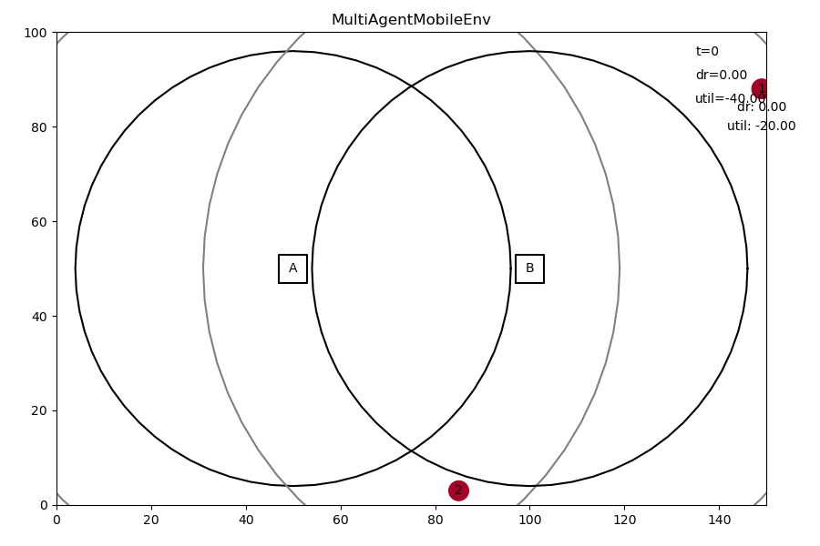

# deep-rl-mobility-management

Using deep RL for mobility management.



## Setup

To install everything, run

```
# on ubuntu
sudo apt update
sudo apt upgrade
sudo apt install cmake build-essential zlib1g-dev python3-dev

# while the issues below persist
pip install ray[rllib]
pip install git+https://github.com/stefanbschneider/structlog.git@dev

# on all systems
python setup.py install
```

Tested on Ubuntu 20.04 (on WSL) with Python 3.8. RLlib does not ([yet](https://github.com/ray-project/ray/issues/631)) run on Windows, but it does on WSL.

For saving videos and gifs, you also need to install ffmpeg (not on Windows) and [ImageMagick](https://imagemagick.org/index.php). 
On Ubuntu:

```
sudo apt install ffmpeg imagemagick
```

**While structlog doesn't support deepcopy:**

Install patched version from my `structlog` fork & branch:

```
pip install git+https://github.com/stefanbschneider/structlog.git@dev
```

**Other known issues:**

* [`ray does not provide extra 'rllib'`](https://github.com/ray-project/ray/issues/11274): uninstall and install via `pip` instead of `setup.py`
* [Unable to schedule actor or task](https://github.com/ray-project/ray/issues/6781#issuecomment-708281404)


## Usage

```
deepcomp -h
```

Adjust further settings in `drl_mobile/main.py`.

Training logs, results, videos, and trained agents are saved in the `results` directory.

When running remotely, you can serve the replay video by running:

```
cd results
python -m http.server
```

Then access at `<remote-ip>:8000`.

#### Tensorboard

To view learning curves (and other metrics) when training an agent, use Tensorboard:

```
tensorboard --logdir results/PPO/ (--host 0.0.0.0)
```

Run the command in a WSL not a PyCharm terminal. Tensorboard is available at http://localhost:6006

## Documentation

* See documents in `docs` folder
* See docstrings in code (TODO: generate read-the-docs in the end for v1.0)

## Research

Evaluation results: https://github.com/CN-UPB/b5g-results

### Available Machines

tango4, tango5, (swc01)

### Status

* RL learn reasonable behavior, very close to greedy-all heuristic, ie, trying to connect to all BS
* For Multi-agent PPO, that makes sense since each agent/UE greedily tries to maximize own utility, even if it hurts other's utilities (not considered in reward)
    * It still can learn to disconnect weak connections of UEs that have fully satisfied data rate anyways through another connection
* For central PPO, it doesn't - but it still doesn't learn fairer behavior
    * That's weird because often greedy-best, with a single connection per UE, gets better overall utility, which is also what central PPO optimizes
* Problem trade-off not clear:
    * Fairness? UEs should only connect to multiple BS if it increases their utility enough to justify samll reductions in utility for other connected UEs?
    * Or explicit cost/overhead for multiple concurrent connections? 
        * Even when penalizing concurrent connections, the RL agent still only learned to behave similar to greedy-all. 
        * It should have learned to only use concurrent connections if it is really useful for improving utility, ie, at the edge. Not when the UE is close to another BS anyways.
* Problem scenario not clear: Do we typically have >1 UE per BS? So few BS and many UEs or the other way around? Or neither
* I tried many variations of observations (different components, different normalization).
    * Overall, normalization is crucial for central PPO (weirdly not so much for multi-agent).
    * Binary connected, dr and total_dr obs seem to work best so far
    * Adding info about connected UEs per BS, about BS that are in range, about number of connected BS, about unshared dr, postion & movement (distance to BS), etc did not help or even reduce performance
* Training takes long for many UEs (>5). But multi-agent can infere to envs with more UEs and works fine even with 30, 40, etc UEs (still similar to greedy-all)

### Todos

* Measure & plot avg reward over time within a single continuous "episode"
* Always return `done=False` for infinite episode. But set some eval eps length in simulation

* Implement LTE baseline and optimization approach
* Increase train performance by setting config['monitor'] to false?
* Evaluation: 
    * Double check all units in my scenario, esp. for movement, distance, dr. Makes sense?
    * CDF of avg UE rate
    * Different utilities for each UE? Shift log function to cut x-axis at different points correspondign to the requirement
        * Then normalize data rates accordingly
    * LTE baseline: Select BS with highest long-term avg SINR
* Optimization approach: Numerical optimization of instantaneous total utility?
* Real-world traces for UE movement somewhere? From 5G measurement mmW paper?
* Multi-agent RL became really slow when training somehow. Why? Any way to improve performance in general? Simulation quite slow with many UEs.
    * Much slower than centralized for the same number of training steps
* Fix installation: Does not work reliably (once structlog is updated with deepcopy support)

* Improve performance: Enable user and station debug logging to see how many times SNR etc are calculated for a single step!
    * Also, didn't the small env with 1 UE use to converge within 20k? Now we need 100k. Or is that due to the longer episodes (now 100, earlier much shorter)?
    
Later:

* Let agent coordinate the number/amount of RBs per connected UE actively. With log utility, a centralized agent should learn proportional-fair scheduling by itself.
* optimize performance by using more numpy arrays less looping over UEs
* Add custom metrics (eg, dr and utility etc) via ray: https://docs.ray.io/en/latest/rllib-training.html#callbacks-and-custom-metrics
    * Allows visualization via tensorboard and access via training results
    * But I still need them for the heuristics...


### Findings

* Binary observations: (BS available?, BS connected?) work very well
* Replacing binary "BS available?" with achievable data rate by BS does not work at all
* Probably, because data rate is magnitudes larger (up to 150x) than "BS connected?" --> agent becomes blind to 2nd part of obs
* Just cutting the data rate off at some small value (eg, 3 Mbit/s) leads to much better results
* Agent keeps trying to connect to all BS, even if out of range. --> Subtracting req. dr by UE + higher penalty (both!) solves the issue
* Normalizing loses info about which BS has enough dr and connectivity --> does not work as well
* Central agent with observations and actions for all UEs in every time step works fine with 2 UEs
* Even with rate-fair sharing, agent tends to connect UEs as long as possible (until connection drops) rather than actively disconnecting UEs that are far away
* This is improved by adding a penalty for losing connections (without active disconnect) and adding obs about the total current dr of each UE (from all connections combined)
* Adding this extra obs about total UE dr (over all BS connections) seems to slightly improve reward, but not a lot
* Multi-agent RL learns better results more quickly than a centralized RL agent
    * Multi-agents using the same NN vs. separate NNs results in comparable performance (slightly worse with separate NN). 
    * Theoretically, separate NNs should take more training as they only see one agent's obs, but allow learning different policies for different agents (eg, slow vs fast UEs)
* Training many workers in parallel on a server for much longer (eg, 100 iters), does improve performance!
* More training + extra observation on the number of connecte UEs --> central agents learns to not be too greedy and only connect to 1 BS to not take away resources from other UE
    * Seems like this is due to longer training, not the additional observation (even though eps reward is slightly higher with the obs)
    * It seems like the extra obs rather hurts the agent in the MultiAgent setting and leads to worse reward --> disable
* Agent learns well also with random waypoint UE movement. Multi-agent RL learns much faster than centralized.
* Another benefit of multi-agent RL is that we can train with few UEs and then extend testing to many more UEs that use the same NN. 
That doesn't work with centralized RL as the fixed NN size depends on the number of UEs.
* Log utility: Also works well (at least multi agent)! Absolute reward not comparable between step and log utility
* Different normalization and cutoff works better for log utility
* Central agent is much more sensitive to normalization!

## Development

* The latest version uses the [RLlib](https://docs.ray.io/en/latest/rllib.html) library for multi-agent RL.
* There is also an older version using [stable_baselines](https://stable-baselines.readthedocs.io/en/master/) for single-agent RL
in the [stable_baselines branch](https://github.com/CN-UPB/deep-rl-mobility-management/tree/stable_baselines) (used for v0.1-v0.3).
* The RLlib version on the `rllib` branch is functionally roughly equivalent to the `stable_baselines` branch (same model, MDP, agent), just with a different framework.
* Development continues in the `dev` branch.
* The current version on `master` and `dev` do not support `stable_baselines` anymore.

## Things to Evaluate

TODO: save all checkpoints and load best. not just last 10 - sometimes the agent gets a bit worse with long training

* Impact of num UEs (fixed or varying within an episode)
* Distance between BS (density)
* UE movement
* Fairness parameter of multi agent
* Squentialization of multi agent
* Resource sharing models
* Scalability: Num BS and UE
* Generalization
