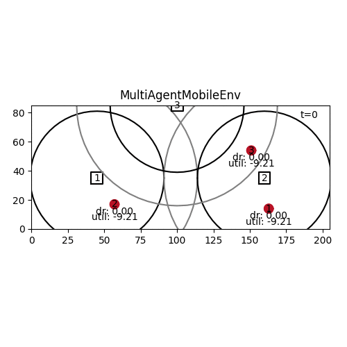

# deep-rl-mobility-management

Using deep RL for mobility management.



## Setup

To install everything, run

```
# on ubuntu
sudo apt update
sudo apt upgrade
sudo apt install cmake build-essential zlib1g-dev

# on all systems
python setup.py install
```

Tested on Ubuntu 20.04 (on WSL) with Python 3.8. RLlib does not ([yet](https://github.com/ray-project/ray/issues/631)) run on Windows, but it does on WSL.

For saving videos and gifs, you also need to install ffmpeg (not on Windows) and [ImageMagick](https://imagemagick.org/index.php). 
On Ubuntu:

```
sudo apt install ffmpeg imagemagick
```

**While structlog doesn't support deepcopy:**

Install patched version from my `structlog` fork & branch:

```
pip install git+https://github.com/stefanbschneider/structlog.git@dev
```


## Usage

```
deepcomp -h
```

Adjust further settings in `drl_mobile/main.py`.

Training logs, results, videos, and trained agents are saved in the `results` directory.

When running remotely, you can serve the replay video by running:

```
cd results
python -m http.server
```

Then access at `<remote-ip>:8000`.

#### Tensorboard

To view learning curves (and other metrics) when training an agent, use Tensorboard:

```
tensorboard --logdir results/PPO/ (--host 0.0.0.0)
```

Run the command in a WSL not a PyCharm terminal. Tensorboard is available at http://localhost:6006

## Documentation

* See documents in `docs` folder
* See docstrings in code (TODO: generate read-the-docs in the end for v1.0)

## Research

### Available VMs

tango4, tango5

### Todos

* Add total dr and utility in rendered video (below time)
* Evaluation: 
    * Comparison with heuristics and random baseline
    * Also compare multi-agent & centralized with limited training time
    * Metrics: Total & avg reward, total data rate, total utility, total unsuccessful connect attempts, total lost connections, CDF of avg UE rate
* Ideas for improving the observation space:
    * Curr normalization of dr based on required dr is taylored to step function
    * For log utility it still somewhat makes sense to normalize for req_dr 1, since `f(x)=4log(0.1+x)=0 <=> x=0.9` --> Normalize based on where the utility function has y=0?
    * Instead of normalized dr, use normalized utility in the observation --> apply log utility function to achievable dr and use that in obs. Normalize with -10, +10 as reward range
    * Or just do automatic running mean normalization: https://github.com/ray-project/ray/issues/9399 Didn't work at all for step utility, but might for log utility
    * Add extra obs for indicating whether a UE can connect or not: Either binary or cont. in `[-1,1]`, where 0= can just connect --> helps planning to disconnect?
        * Or just distance to a BS somehow. Eg, normalized with the distance for connecting. Then extra obs for the data rate
    * Add UE position and movement to observations; in multi-agent
* Optimization approach: Numerical optimization of instantaneous total utility?
* Real-world traces for UE movement somewhere?
* (continue training after loading weights)
    
Later:

* Let agent coordinate the number/amount of RBs per connected UE actively. With log utility, a centralized agent should learn proportional-fair scheduling by itself.
    

### Findings

* Binary observations: (BS available?, BS connected?) work very well
* Replacing binary "BS available?" with achievable data rate by BS does not work at all
* Probably, because data rate is magnitudes larger (up to 150x) than "BS connected?" --> agent becomes blind to 2nd part of obs
* Just cutting the data rate off at some small value (eg, 3 Mbit/s) leads to much better results
* Agent keeps trying to connect to all BS, even if out of range. --> Subtracting req. dr by UE + higher penalty (both!) solves the issue
* Normalizing loses info about which BS has enough dr and connectivity --> does not work as well
* Central agent with observations and actions for all UEs in every time step works fine with 2 UEs
* Even with rate-fair sharing, agent tends to connect UEs as long as possible (until connection drops) rather than actively disconnecting UEs that are far away
* This is improved by adding a penalty for losing connections (without active disconnect) and adding obs about the total current dr of each UE (from all connections combined)
* Adding this extra obs about total UE dr (over all BS connections) seems to slightly improve reward, but not a lot
* Multi-agent RL learns better results more quickly than a centralized RL agent
    * Multi-agents using the same NN vs. separate NNs results in comparable performance (slightly worse with separate NN). 
    * Theoretically, separate NNs should take more training as they only see one agent's obs, but allow learning different policies for different agents (eg, slow vs fast UEs)
* Training many workers in parallel on a server for much longer (eg, 100 iters), does improve performance!
* More training + extra observation on the number of connecte UEs --> central agents learns to not be too greedy and only connect to 1 BS to not take away resources from other UE
    * Seems like this is due to longer training, not the additional observation (even though eps reward is slightly higher with the obs)
    * It seems like the extra obs rather hurts the agent in the MultiAgent setting and leads to worse reward --> disable
* Agent learns well also with random waypoint UE movement. Multi-agent RL learns much faster than centralized.
* Another benefit of multi-agent RL is that we can train with few UEs and then extend testing to many more UEs that use the same NN. 
That doesn't work with centralized RL as the fixed NN size depends on the number of UEs.
* Log utility: Also works well (at least multi agent)! Absolute reward not comparable between step and log utility

## Development

* The latest version uses the [RLlib](https://docs.ray.io/en/latest/rllib.html) library for multi-agent RL.
* There is also an older version using [stable_baselines](https://stable-baselines.readthedocs.io/en/master/) for single-agent RL
in the [stable_baselines branch](https://github.com/CN-UPB/deep-rl-mobility-management/tree/stable_baselines) (used for v0.1-v0.3).
* The RLlib version on the `rllib` branch is functionally roughly equivalent to the `stable_baselines` branch (same model, MDP, agent), just with a different framework.
* Development continues in the `dev` branch.
* The current version on `master` and `dev` do not support `stable_baselines` anymore.
