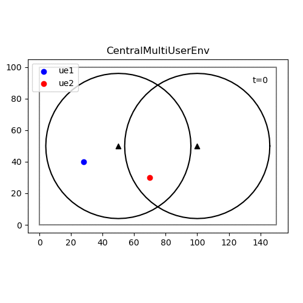

# deep-rl-mobility-management

Simple simulation of mobility management scenario to use with deep RL



## Setup

Should work with Python 3.6+. Tested with Python 3.7. 
Tensorflow 1 doesn't work on Python 3.8 but is required by stable_baselines.

```
pip install -r requirements
```

For saving gifs, you also need to install [ImageMagick](https://imagemagick.org/index.php).

### Installing RLlib

Ray supports TF2 and thus also Python 3.8.

```
pip install ray[rllib]
```

It may fail installing `gym[atari]`, which needs the following dependencies that can be installed with `apt`:
`cmake, build-essentials, zlib1g-dev`. 
RLlib does not ([yet](https://github.com/ray-project/ray/issues/631)) run on Windows, but it does on WSL.

## Usage

Adjust and run `main.py` in `drl_mobile`:

```
cd drl_mobile
python main.py
```

## Todos

* Multiple UEs: 
    * Multi-agent: Separate agents for each UE. I should look into ray/rllib: https://docs.ray.io/en/latest/rllib-env.html#multi-agent-and-hierarchical
    * Collaborative learning: Share experience or gradients to train agents together. Use same NN. Later separate NNs? Federated learing.
* Generic utlitiy function: Currently, reward is a step function (pos if enough rate, neg if not). Could also be any other function of the rate, eg, logarithmic
* Efficient caching of connection data rate:
    * Currently always recalculate the data rate per connection per UE, eg, when calculating reward or checking whether we can connect
    * Safe & easy, but probably slow for many UEs/BSs. Let's see
    * Instead, write the dr per connection into a dict (conn --> curr dr); then derive total curr connection etc from that in O(1)
    * Needs to be updated whenever the UE moves or any UE changes its connections (this or another UE)
    * Eg, 1st move all UEs, 2nd check & update connections of all UEs, 3rd calculate reward etc

### Multi-Agent RL with rllib

* Seems like rllib already supports multi-agent environments
* Anyway seems like the (by far) most complex/feature rich but also mature RL framework
* Doesn't run on Windows yet: https://github.com/ray-project/ray/issues/631 (but should on WSL)
* Multi agent environments: https://docs.ray.io/en/latest/rllib-env.html#multi-agent-and-hierarchical
* Multi agent concept/policies: https://docs.ray.io/en/latest/rllib-concepts.html#policies-in-multi-agent
* Also supports parameter sharing for joint learning; hierarchical RL etc --> rllib is the way to go
* It's API both for agents and environments (and everything else) is completely different

Dev plan:

0. Done: Experiment with rllib and existing environments in separate rl-experiments repo
1. WIP: Switch to rllib and verify single-UE case still works as before. Keep working stable baselines code in separate branch
    * Non-trivial: Framework needs several changes in environment and overall workflow. Currently, everything is crashing and errors don't make sense.
    * Solved: tf import; https://github.com/ray-project/ray/issues/8993
    * WIP: structlog works in dummy env, but not real env
2. Build joint codebase for running both RLlib and stable_baselines. Eg, different packages with variations of main script; use env_config for all envs
2. Move to multi-user and multi-UE environment with rllib

## Findings

* Binary observations: [BS available?, BS connected?] work very well
* Replacing binary "BS available?" with achievable data rate by BS does not work at all
* Probably, because data rate is magnitudes larger (up to 150x) than "BS connected?" --> agent becomes blind to 2nd part of obs
* Just cutting the data rate off at some small value (eg, 3 Mbit/s) leads to much better results
* Agent keeps trying to connect to all BS, even if out of range. --> Subtracting req. dr by UE + higher penalty (both!) solves the issue
* Normalizing loses info about which BS has enough dr and connectivity --> does not work as well
