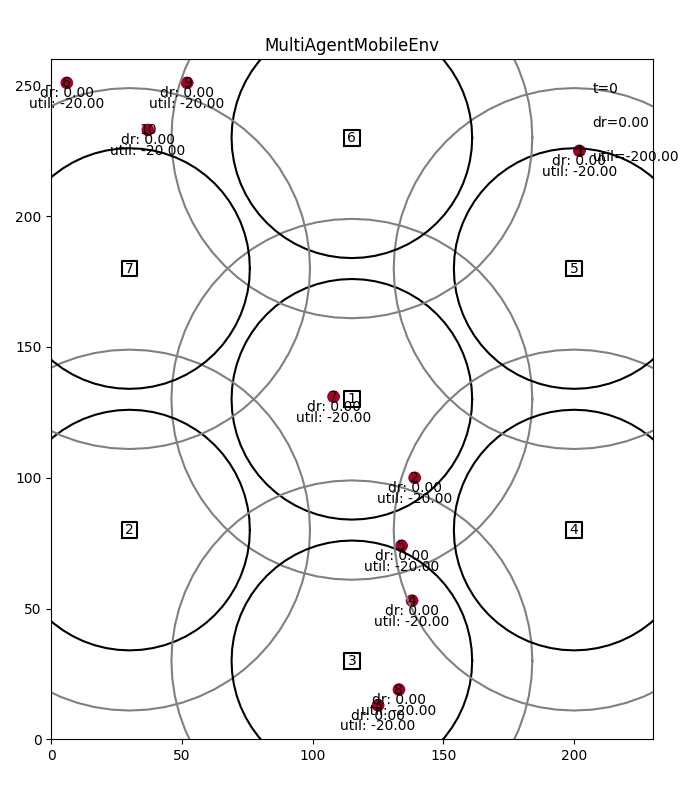
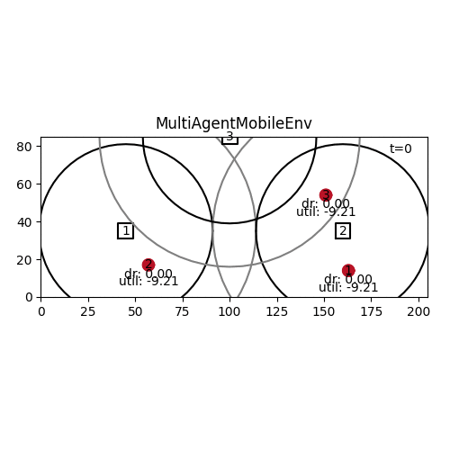

# MDP Formulation & Release Details

## Latest MDP Formulation

Using the multi-agent environment with the latest common configuration.

*Observations*: Observation for each agent (controlling a single UE)

* Currently connected BS (binary vector)
* Achievable data rate to each BS. Processed/normlaized to `[0, 1]` by dividing with the max. data rate of all possible BS connections
* Total utility of the UE. Also normalized to `[0,1]`.
* Multi-agent only: Binary vector of which BS are currently idle, ie, without any UEs

*Actions*:

* Discrete selection of either noop (0) or one of the BS.
* The latter toggles the connection status and either tries to connects or disconnect the UE to/from the BS, depending on whether it currently already is connected.
* All UEs take an action simultaneously in every time step

*Reward*: Immediate rewards for each time step

* Utility for each UE based on the current total data rate: `np.clip(10 * np.log10(curr_dr), -20, 20)`
    * 0 utility for 1 dr, 20 utility (max) for 100 dr
    * Normalized to `[-1, 1]`
* Central PPO: Rewards of all UEs are summed 
* Multi-agent PPO: Mix of own utility and utility of other UEs at the same BS to learn fair behavior: `alpha * own_utility + beta * avg_utility_neighbors`

## Release Details and MDP Changes

### [v0.10](https://github.com/CN-UPB/deep-rl-mobility-management/releases/tag/v0.10): Fair, cooperative multi-agent

* A big drawback of the multi-agent RL so far was that each agent/UE only saw its own observations and optimized only its own utility
* This lead to greedy behavior of all UEs connecting to every BS in range
* This againg lead to overall lower total data rate and utility as UEs were stealing resources from each other
* This release comes with a new observation space, where data rates are normalized differently and where idle BS are indicated, which can be selected without harming other BS
* The reward for multi-agent PPO is also adjusted to contain the avg. reward of other UEs that are connected to the same BS
* With this multi-agent PPO learns cooperative behavior, where each agent only connects to its strongest BS without stealing resources from other UEs (in high-load scenarios)
* In low-load scenarios, both PPO agents still learn to use available resources
* Thanks to the new observation space, PPO central now often finds the optimal solution and performs perfect handovers

Example: Cooperative multi-agent PPO after 500k training (converged after 200k)

### [v0.9](https://github.com/CN-UPB/deep-rl-mobility-management/releases/tag/v0.9): Preparation for Evaluation

* New variants for observation (components, normalization, ...) and reward (utility function and penalties)
* New larger scenario and adjusted rendering
* New utility scripts for evaluation: Running experiments and visualzing results
* Bug fixes and refactoring
* Default radio model is resource-fair again (more stable than proportional-fair)

Example: Multi-agent PPO with resource-fair sharing after 500k training

### [v0.8](https://github.com/CN-UPB/deep-rl-mobility-management/releases/tag/v0.8): Environment & Model Improvements, New Heuristic Algorithms (week 29)

* New, configurable UE movement: Either uniformly in one direction or following random waypoints
* Configurable number of slow and fast UEs in the environment via CLI
* New, configurable UE utility model: New default is log utility (`util(dr) = 4*log(0.1+dr)`) and replaces the step utility based on a required data rate
* Fixed & refactored environment step function: Properly updated *all* UEs' actions before moving them and calculating the reward
* Cache UE-BS data rates for considerably faster simulations (episodes are roughly 30-40% faster)
* Added [proportional-fair sharing](https://en.wikipedia.org/wiki/Proportionally_fair) as new default radio sharing model. See [visualization of different sharing models](https://github.com/CN-UPB/deep-rl-mobility-management/blob/master/docs/model.md#radio-sharing-model).
* Added 2 greedy heuristics as evaluation baselines: Connecting greedily to single best BS or to all BS
* Improved visualization: Continuous color indicates utility + utility is shown directly

Example: Multi-agent PPO with new UE movement and proportional-fair sharing and utility after 200k training

### [v0.7](https://github.com/CN-UPB/deep-rl-mobility-management/releases/tag/v0.7): Larger Environment (week 27)

* Larger environment with 3 BS and 4 moving UEs. 
Can be solved by both multi- and central-agent RL, but needs much more training (see comparison below).
* Extra observation (optional) showing number of connected UEs per BS. To help learn balancing connections. Seems not to be very useful.
* Improved visualization
* Improved install. Added CLI support.

Multi-agent (gray) learns much quicker, but central agent (orange) ultimately learns a slightly better policy:

Example: Multi-agent PPO on the new, larger env after 200k training

### [v0.6](https://github.com/CN-UPB/deep-rl-mobility-management/releases/tag/v0.6): Multi-agent RL (week 27)

* Support for multi-agent RL: Each UE is trained by its own RL agent
* Currently, all agents share the same RL algorithm and NN
* Already with 2 UEs, multi-agent leads to better results more quickly than a central agent

Example: Multi-agent PPO after 25k training

### [v0.5](https://github.com/CN-UPB/deep-rl-mobility-management/releases/tag/v0.5): Improved radio model (week 26)

* Improved [radio model](https://github.com/CN-UPB/deep-rl-mobility-management/blob/master/docs/model.md):
    * Configurable model for sharing resources/data rate between connected UEs at a BS. Support capacity maximization, rate-fair, and resource-fair sharing. Use rate-fair as new default.
    * Allow UEs to connect based on SNR not data rate threshold
    * Clean up: Removed unused interference calculation from model (assume no interference)
* Improved observations:
    * Environment variant with extra observation indicating each UE's total current data rate in `[-1, 1]`: 0 = requirements exactly fulfilled
    * Improves avg. episode reward from 343 (+- 92) to 388 (+- 111); after 30k train, tested over 30 eps
    * Dict space obs allow distinguishing continuous data rate obs and binary connected obs. Were both treated as binary (Box) before --> smaller obs space now
* Penalty for losing connection to BS through movement rather than actively disconnecting --> Agent learns to disconnect
* Small improvements in RLlib setup & workflow and in visualization (show rough BS range for accepting connections in gray)

Example: Centralized PPO agent controlling two UEs after 30k training with RLlib. Using the new rate-fair sharing model and obs.

### [v0.4](https://github.com/CN-UPB/deep-rl-mobility-management/releases/tag/v0.4): Replaced stable_baselines with ray's RLlib (week 26)

* Replaced the RL framework: [RLlib](https://docs.ray.io/en/latest/rllib.html) instead of [stable_baselines](https://stable-baselines.readthedocs.io/en/master/)
* Benefit: RLlib is more powerful and supports multi-agent environments
* Refactored most parts of the existing code base to adjust to the new frameworks API
* Radio model and MDP remained unchanged

Example: Centralized PPO agent controlling two UEs after 20k training with RLlib

### [v0.3](https://github.com/CN-UPB/deep-rl-mobility-management/releases/tag/v0.3): Centralized, single-agent, multi-UE-BS selection, basic radio model (week 25)

* Simple but improved radio load model: 
    * Split achievable load equally among connected UEs
    * Allow connecting to any BS if the achievable data rate is above a 10% threshold of the required rate
    * Data rate from multiple BS adds up
* Multiple moving UEs, each selecting to which BS to connect
    * UEs may move at different speeds
    * Single agent that sees/controls combined observations and actions for all UEs in every time step
    * Observation: Achievable data rate for all UEs, connected BS for all UEs (auto clipped, normalized as before)
    * Action: Selected BS (or no-op) for all UEs
* Discussion:
    * This means, observation and action space grow linearly with the number of UEs, which has to be fixed
    * Trying to avoid this by just having obs and actions for a single UE (as before) does not work:
        * Either: Obs for UE1, action for UE1, obs for UE2, action for UE2, obs for UE1, ...
        Here, the agent does not learn the env dynamics, because it does not see the impact of an action, ie, next obs.
        * Or: Action for UE1, obs for UE1, action for UE2, obs for UE2, ...
        Here, the agent sees obs from a different UE than what it is making decisions for. Choosing a proper action becomes impossible.
    * Adding the current UE's ID to the obs does not help and still leads to divergence
    * The updated radio model allows and encourages the agent to connect UEs to multiple BS since their rate adds up and they can connect from farther away

Example: Centralized PPO agent controlling two UEs after 20k training

### [v0.2](https://github.com/CN-UPB/deep-rl-mobility-management/releases/tag/v0.2): Just BS selection, basic radio model (week 21)

* Same as v0, but with path loss, SNR to data rate calculation. No interference or scheduling yet.
* State/Observation: S = [Achievable data rates per BS (processed), connected BS]
    * Using achievable dr directly, works very poorly. 
    Suspected reason: Data rates are much larger (up to 150x) than the connected values, such that 
    the agent basically cannot see anymore to which BS it is connected
    * Simply cutting off data rates, eg, at 3 Mbit/s, works much better. Problem: Where to cut off?
    * First subtracting the required data rate from the achievalbe data rate helps a lot!
    It changes the observation to be negative if the data rate doesn't suffice.
    * What works best is auto clipping and normalization:
        1. Subtract the required data rate --> Obs. negative if data rate too small
        1. Cut off data rate at req data rate --> Obs. range now [-req_dr, +req_dr].
        1. Normalize by dividing by req. data rate --> Obs. range now [-1, 1]
* Action space as before: Select a BS to connect/disconnect in each time step for the single UE

Example: PPO with auto clipping & normalization observations after 10k training

### [v0.1](https://github.com/CN-UPB/deep-rl-mobility-management/releases/tag/v0.1): Just BS selection, no radio model (week 19)

Env. dynamics:

* Only one moving UE. Multiple (2) BS. UE selects to which BS(s) to connect
* No radio model yet, instead, each BS has a fixed range, which it covers. No capacities yet.
* Worked with an out-of-the box RL agent (PPO algorithm)

Observations: 

* Binary vector of |S|=2x num BS with S = [available BS, connected BS].
* Eg. S = [1, 1, 0, 1] means that both BS are available (in range) but the UE currently is only connected to the 2nd BS.

Action: 

* 1 action/decision in each time step to connect or disconnect from BS
* Action space: {0, 1, ..., num BS}. 0 = no op. = keep everything as is. 1+ = if not connected to BS i yet, connect (try); if connected already, disconnect

Reward:

* +10 for each time step in which UE is connected to at least one BS
* -10 for each time step in which it isn't
* -1 if connection attempt failed (agent tried to connect to BS that's out of reach)
