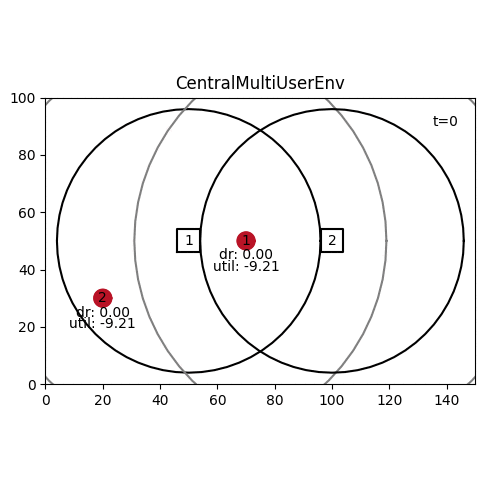

# Environment Model

* Moving UEs
* Fixed base stations (BSs)
* Actions in every time step

## Radio Model

Radio model mostly implemented in [`drl_mobile/env/station.py`](https://github.com/CN-UPB/deep-rl-mobility-management/blob/master/drl_mobile/env/station.py).

* Focus so far just on downstream, not upstream traffic
* All BS have the same fixed bandwidth, frequency, noise, TX power, and height.
* Based on these and the distance to a UE, the path loss is calculated following the Okumura Hata model for suburban indoor.
* Based on the path loss the SNR for each UE can be calculated
* We assume no interference between UEs and BS based on the following assumptions:
    * BS assign different resource blocks (RB) to different UEs (different time or frequency).
    Hence, there is no interference between UEs at the same BS.
    * Neighboring BS do not use the same RBs but have slightly shifted frequencies.
    Hence, there is no cinterference between BSs.
* We do not consider assignment of RBs explicitly, but assume that
    * BS assign all RBs to connected users, ie, transmit as much data rate as possible
    * It's configurable how the data rate is shared among connected UEs: See below
* UEs can connect to multiple BS and their data rates add up
* UEs can only connect to BS that are not too far away, ie, where SNR is above a fixed threshold   

### Radio sharing model

BS support different, configurable sharing models: Max. capacity, resource-fair, or rate-fair sharing.

#### Max. capacity

Maximize capacity by assigning full data rate to the UE with highest achievable data rate. 0 to all other UEs.

#### Resource-fair sharing

Split RBs equally among all connected UEs. Assume infinitely many and small RBs. Results in different data rates based on distance/path loss: `dr_nominal = dr / num_ues`

#### Rate-fair sharing (prev default)

Ensure same data rate for all connected UEs. Connecting far-away UEs becomes very expensive and decreases total capacity and rate for all connected UEs.

#### Proportional-fair sharing (new default)

Balance capacity maximization and resource-fair sharing, by calculating a priority for each UE: [Wikipedia](https://en.wikipedia.org/wiki/Proportionally_fair#User_prioritization).
Split RBs proportional to that priority. Tune fairness using weights alpha and beta (between extremes max. cap. and resource-fair).

By default, the EWMA is calculated with weight 0.9: `self.ewma_dr = weight * self.curr_dr + (1 - weight) * self.ewma_dr` and the priority
uses fairness weights `alpha=beta=1`, similar to 3G.

